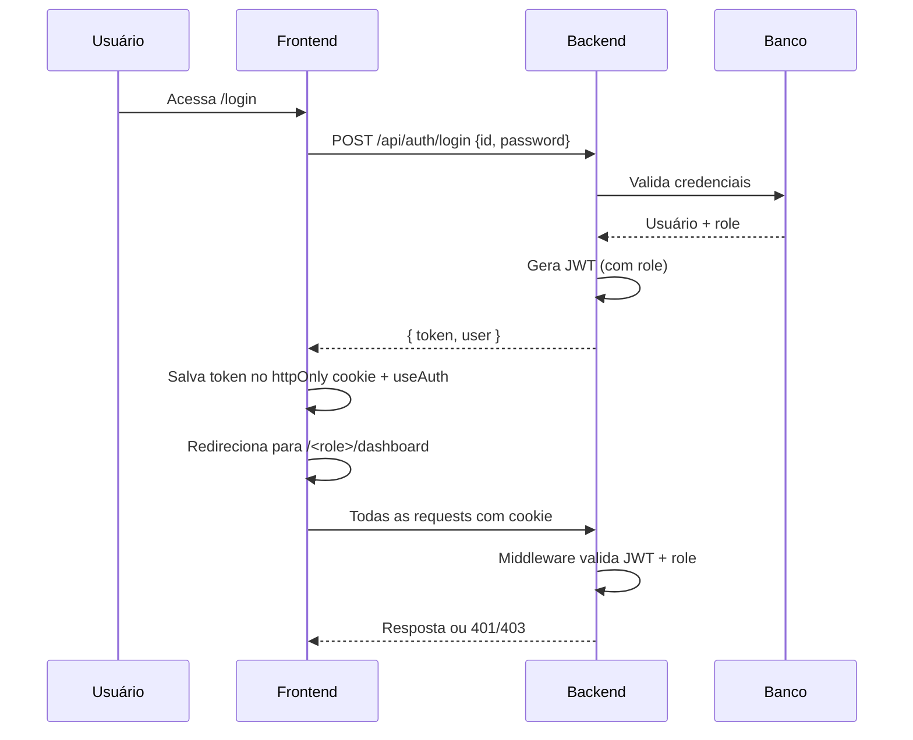

```markdown
# Autenticação e RBAC (Role-Based Access Control)

**Documento Técnico**  
**Projeto:** SGE

## 1. Objetivo

Este documento descreve:
- O **fluxo completo de RBAC** já implementado no **frontend**.
- A **arquitetura de autenticação** que deve ser implementada no **backend**.

---

## 2. Roles Definidas no Sistema

| Role       | Nome no Código | Descrição                              | Dashboard Base          |
|------------|----------------|----------------------------------------|-------------------------|
| `admin`    | `admin`        | Administrador da plataforma            | `/admin/dashboard`      |
| `aluno`    | `aluno`        | Estudante                              | `/aluno/dashboard`      |
| `professor`| `professor`    | Professor                              | `/professor/dashboard`  |

---

## 3. Fluxo Atual no Frontend (Mock)

### 3.1. Arquivos Principais

| Arquivo                              | Responsabilidade |
|--------------------------------------|------------------|
| `lib/mock-auth.ts`                   | Usuários simulados + função `mockLogin` |
| `hooks/use-auth.ts`                  | Hook de autenticação (localStorage) |
| `components/role-guard.tsx`          | Proteção de rotas por role + redirecionamento |
| `components/login-form.tsx`          | Formulário reutilizável |
| `app/(auth)/login/page.tsx`          | Login Admin |
| `app/(auth)/student-login/page.tsx`  | Login Aluno |
| `app/(auth)/professor-login/page.tsx`| Login Professor |
| `app/admin/layout.tsx`               | Layout + `RoleGuard` para admin |
| `app/aluno/layout.tsx`               | Layout + `RoleGuard` para aluno |
| `app/professor/layout.tsx`           | Layout + `RoleGuard` para professor |
| `components/app-sidebar.tsx`         | Sidebar Admin (dinâmico) |
| `components/student-app-sidebar.tsx` | Sidebar Aluno |
| `components/professor-app-sidebar.tsx`| Sidebar Professor |

### 3.2. Como funciona a proteção (RoleGuard)

1. Todo layout de role envolve o componente `<RoleGuard requiredRole="xxx">`.
2. O `RoleGuard`:
   - Usa `useAuth()` para ler o usuário do `localStorage`.
   - Se não estiver logado → redireciona para `/login`.
   - Se o role não bater → redireciona automaticamente para o dashboard correto do usuário.
   - Mostra spinner de “Verificando permissões...” enquanto carrega.
3. Os sidebars são carregados **dentro** do `RoleGuard`, garantindo que só usuários autorizados vejam o menu.

### 3.3. Login (Mock)

- ID + Senha → `mockLogin()` → retorna usuário com `role`.
- `useAuth().login(user)` salva no `localStorage`.
- Redirecionamento automático para o dashboard do role.

---

## 4. Autenticação no Backend (Especificação para Produção)

### 4.1. Tecnologias Recomendadas

| Item               | Recomendação                          | Alternativa          |
|--------------------|---------------------------------------|----------------------|
| Autenticação       | NextAuth.js v5 (Auth.js)              | Custom JWT           |
| Banco de dados     | Prisma + PostgreSQL / Supabase        | MongoDB              |
| Token              | JWT (httpOnly cookie)                 | Session cookie       |
| Proteção de rotas  | Middleware do Next.js                 | Server Components    |

**Recomendação forte:** Usar **NextAuth.js** com **Credentials Provider** + **JWT strategy**.

### 4.2. Endpoints da API (Backend)

```http
POST   /api/auth/login          → Recebe { id, password } → retorna JWT + userS
POST   /api/auth/logout         → Limpa cookie
GET    /api/auth/session        → Retorna usuário atual (usado no client)
GET    /api/admin/*             → Protegido (role === 'admin')
GET    /api/aluno/*             → Protegido (role === 'aluno')
GET    /api/professor/*         → Protegido (role === 'professor')
```

### 4.3. Payload do JWT (exemplo)

```json
{
  "id": "DL23001",
  "name": "João Estudante",
  "email": "joao@gmail.com,
  "role": "aluno",
  "iat": 1744220000,
  "exp": 1744306400
}
```

### 4.4. Middleware (Next.js)

Crie o arquivo `middleware.ts` na raiz:

```ts
import { withAuth } from "next-auth/middleware";
import { NextResponse } from "next/server";

export default withAuth(
  function middleware(req) {
    const { pathname } = req.nextUrl;
    const token = req.nextauth.token;

    // Proteção por role
    if (pathname.startsWith("/admin") && token?.role !== "admin") {
      return NextResponse.redirect(new URL("/aluno/dashboard", req.url));
    }
    if (pathname.startsWith("/aluno") && token?.role !== "aluno") {
      return NextResponse.redirect(new URL("/admin/dashboard", req.url));
    }
    // ... mesmo para professor
  },
  {
    callbacks: {
      authorized: ({ token }) => !!token,
    },
  }
);

export const config = {
  matcher: ["/admin/:path*", "/aluno/:path*", "/professor/:path*"],
};
```

### 4.5. Fluxo Completo de Login (Produção)

