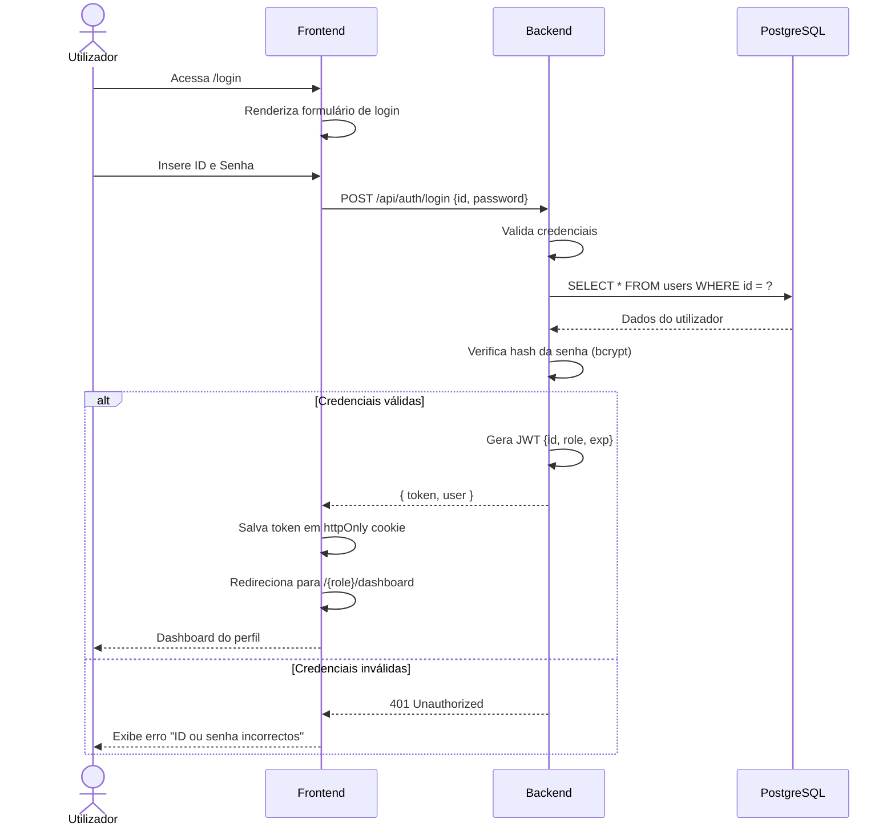
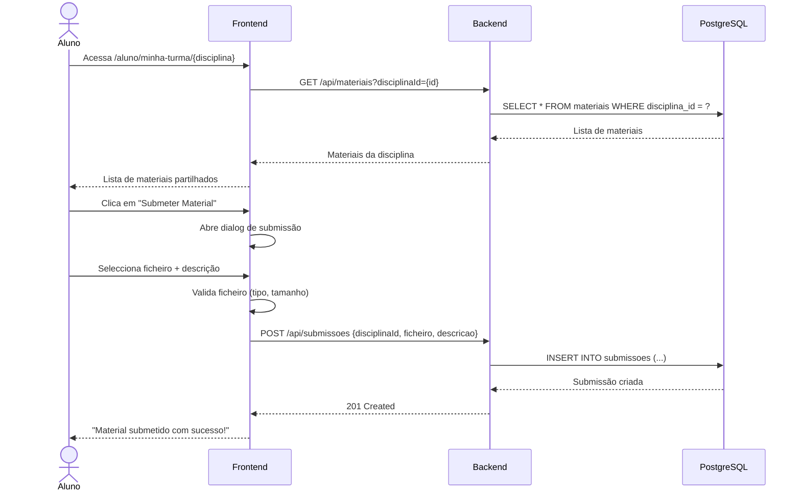
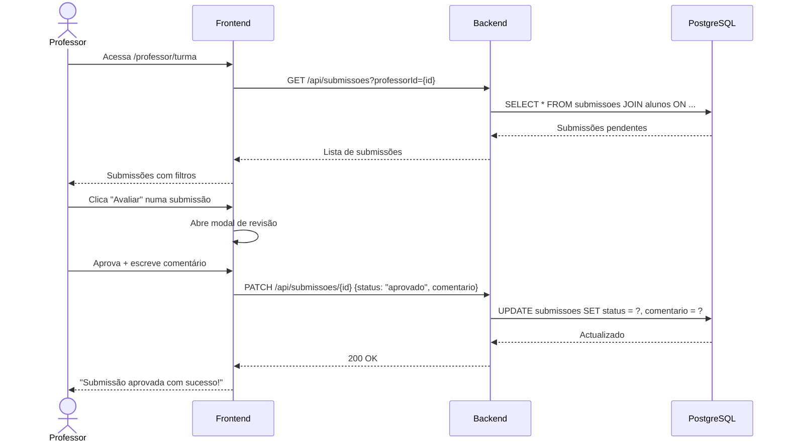
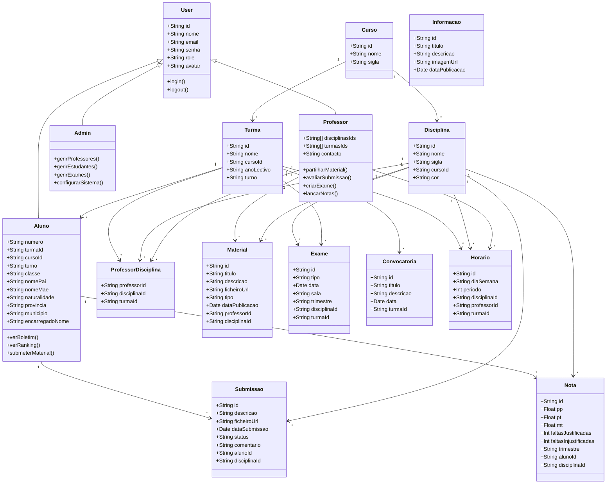
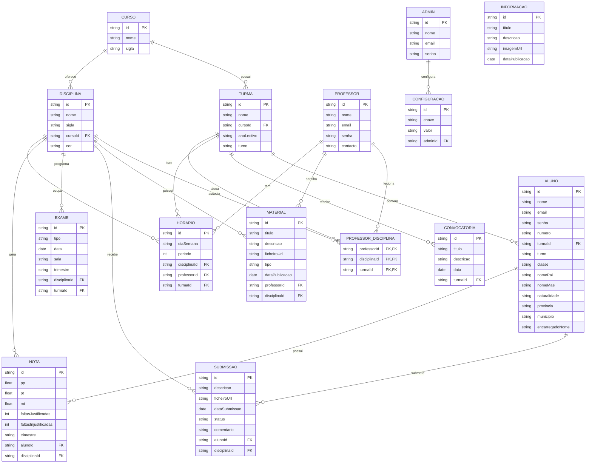

# SGE — Sistema de Gestão Escolar

## Sobre o Projecto

O **SGE (Sistema de Gestão Escolar)** é uma plataforma web moderna desenvolvida para o **Instituto Politécnico Industrial de Luanda**, em Angola. O sistema tem como objectivo digitalizar e centralizar a gestão académica da instituição, oferecendo um ambiente integrado para alunos, professores e administradores.

O projecto abrange três perfis de utilizador:

- **Aluno** — Acesso a boletins, horários, materiais de estudo, perfil académico e comunicações institucionais.
- **Professor** — Gestão de turmas, partilha de materiais, avaliação de submissões, lançamento de notas e criação de exames.
- **Administrador** — Gestão de professores, estudantes, exames e configurações gerais da plataforma.

---

## Situação Problemática

O Instituto Politécnico Industrial de Luanda enfrenta diversos desafios na sua gestão académica actual:

1. **Processos Manuais e Descentralizados** — O registo de notas, faltas, horários e convocatórias é feito em papel ou em sistemas isolados, dificultando o acesso e a consulta.

2. **Falta de Transparência** — Alunos não têm acesso fácil às suas notas, boletins e desempenho académico em tempo real. Professores e administradores não dispõem de uma visão unificada do progresso dos estudantes.

3. **Comunicação Ineficiente** — A divulgação de informações institucionais (convocatórias, avisos, calendário de exames) é feita de forma fragmentada, sem um canal central.

4. **Dificuldade na Gestão de Turmas e Materiais** — Professores não dispõem de uma plataforma para partilhar materiais, receber submissões e comunicar com os alunos de forma organizada.

5. **Processos Burocráticos** — A matrícula, transferência e gestão de estudantes e professores são processos lentos e propensos a erros devido à falta de automatização.

6. **Inexistência de Estatísticas e Relatórios** — A instituição carece de ferramentas para gerar relatórios de desempenho, taxas de aprovação e outras métricas essenciais para a tomada de decisões.

---

## Solução

O SGE propõe uma plataforma web centralizada, moderna e responsiva que resolve os problemas identificados através de:

- **Digitalização Completa** — Todos os processos académicos (notas, faltas, horários, materiais, avaliações) são geridos digitalmente numa única plataforma.
- **Acesso por Perfis** — Cada utilizador (aluno, professor, admin) tem acesso às funcionalidades relevantes ao seu papel, com navegação personalizada e controlo de permissões.
- **Transparência e Autonomia** — Alunos podem consultar boletins, médias, rankings e horários a qualquer momento. Professores têm visibilidade total sobre as suas turmas.
- **Comunicação Eficiente** — A plataforma permite a publicação de convocatórias, avisos e informações institucionais com alcance imediato.
- **Gestão de Materiais e Submissões** — Professores podem partilhar materiais e os alunos podem submeter trabalhos, tudo num fluxo digital com aprovação e feedback.
- **Estatísticas e Relatórios** — Gráficos interactivos (radial, pizza, área) fornecem métricas de desempenho académico para alunos, professores e administradores.
- **Arquitectura Escalável** — O frontend em Next.js prepara o terreno para integração futura com um backend robusto em NestJS e base de dados PostgreSQL.

---

## Requisitos Funcionais

### RF01 — Autenticação e Controlo de Acesso
| Código | Descrição | Actor |
|---|---|---|
| RF01.1 | O sistema deve permitir que o utilizador faça login com ID e senha | Aluno, Professor, Admin |
| RF01.2 | O sistema deve redirecionar o utilizador para o dashboard correspondente ao seu perfil após login | Aluno, Professor, Admin |
| RF01.3 | O sistema deve bloquear o acesso a páginas não autorizadas para o perfil do utilizador | Aluno, Professor, Admin |
| RF01.4 | O sistema deve permitir que o utilizador faça logout | Aluno, Professor, Admin |

### RF02 — Aluno — Dashboard
| Código | Descrição |
|---|---|
| RF02.1 | O sistema deve exibir o cartão de perfil do aluno com foto, nome, número, turma e classe |
| RF02.2 | O sistema deve exibir o ranking da turma com posição, nome e pontuação de cada aluno |
| RF02.3 | O sistema deve exibir um gráfico radial com a distribuição de notas positivas vs negativas |
| RF02.4 | O sistema deve exibir um gráfico de pizza com as 3 melhores disciplinas do aluno |

### RF03 — Aluno — Meu Perfil
| Código | Descrição |
|---|---|
| RF03.1 | O sistema deve exibir os dados pessoais do aluno (nome, género, altura, estado civil) |
| RF03.2 | O sistema deve exibir os dados complementares (nome do pai, mãe, naturalidade) |
| RF03.3 | O sistema deve exibir os dados de documentação (tipo documento, nº identificação, emissão, validade) |
| RF03.4 | O sistema deve exibir os dados de localização (província, município, comuna) |
| RF03.5 | O sistema deve exibir os dados académicos (área formação, curso, classe, turno, turma, número) |
| RF03.6 | O sistema deve exibir os dados do encarregado (nome, parentesco, contacto) |

### RF04 — Aluno — Minha Turma
| Código | Descrição |
|---|---|
| RF04.1 | O sistema deve exibir um grid de disciplinas com sigla colorida, nome do professor e contagem de materiais |
| RF04.2 | O sistema deve exibir a lista de materiais partilhados por disciplina com ícone por tipo, nome, tamanho, data e botão de download |
| RF04.3 | O sistema deve exibir a nota do professor associada a cada material |
| RF04.4 | O sistema deve permitir que o aluno submeta materiais (upload de ficheiro com descrição opcional) |

### RF05 — Aluno — Horário
| Código | Descrição |
|---|---|
| RF05.1 | O sistema deve exibir uma tabela semanal (Segunda a Sexta) com 6 períodos de manhã e 6 de tarde |
| RF05.2 | O sistema deve exibir separadores visuais para INTERVALO e MUDANÇA DE TURNO |
| RF05.3 | O sistema deve exibir um grid de professores com busca por abreviatura |

### RF06 — Aluno — Horário de Provas
| Código | Descrição |
|---|---|
| RF06.1 | O sistema deve exibir filtros por trimestre (I, II, III) e calendário (1ª Prova, 2ª Prova) |
| RF06.2 | O sistema deve exibir uma tabela scrollável com o calendário de exames |

### RF07 — Aluno — Boletins
| Código | Descrição |
|---|---|
| RF07.1 | O sistema deve exibir uma tabela de notas por disciplina (Nº, Disciplina, Faltas J/I, PP, PT, MT) |
| RF07.2 | O sistema deve colorir as células de nota: vermelho para <10 valores, azul para ≥10 valores |
| RF07.3 | O sistema deve exibir um gauge circular SVG com a média geral do aluno |
| RF07.4 | O sistema deve exibir um gráfico de área comparando MT vs PP por disciplina |

### RF08 — Aluno — Convocatórias
| Código | Descrição |
|---|---|
| RF08.1 | O sistema deve exibir uma carta de convocatória formal com selos institucionais e texto jurídico |
| RF08.2 | O sistema deve exibir uma tabela de convocatórias com seleção de linha e botão de visualização |

### RF09 — Aluno — Informações
| Código | Descrição |
|---|---|
| RF09.1 | O sistema deve exibir uma tabela de avisos institucionais com campo de busca |
| RF09.2 | O sistema deve exibir um modal com o conteúdo completo do aviso e lightbox para imagem |

### RF10 — Professor — Dashboard
| Código | Descrição |
|---|---|
| RF10.1 | O sistema deve exibir cartões de estatísticas (total de aulas, estudantes, média geral, horas lectivas) |
| RF10.2 | O sistema deve exibir a lista de próximos eventos |
| RF10.3 | O sistema deve exibir a lista de materiais recentes partilhados |

### RF11 — Professor — Minha Turma
| Código | Descrição |
|---|---|
| RF11.1 | O sistema deve permitir que o professor partilhe novos materiais (título, descrição, disciplina, ficheiro) |
| RF11.2 | O sistema deve exibir a lista de materiais partilhados com opção de remoção |
| RF11.3 | O sistema deve exibir a lista de submissões dos alunos com filtros (Todas, Pendente, Aprovado, Rejeitado) |
| RF11.4 | O sistema deve permitir que o professor aprove ou rejeite submissões com comentário |

### RF12 — Professor — Estudantes
| Código | Descrição |
|---|---|
| RF12.1 | O sistema deve exibir uma tabela de estudantes com busca por nome |
| RF12.2 | O sistema deve exibir filtros por turma e por trimestre |
| RF12.3 | O sistema deve exibir um modal com o perfil e notas do estudante |

### RF13 — Professor — Exames
| Código | Descrição |
|---|---|
| RF13.1 | O sistema deve exibir cartões de estatísticas (Agendados, Realizados, Taxa de Realização) |
| RF13.2 | O sistema deve exibir filtros por estado e por trimestre |
| RF13.3 | O sistema deve permitir a criação de novo exame (tipo, data, sala, disciplina, trimestre) |

### RF14 — Professor — Horário
| Código | Descrição |
|---|---|
| RF14.1 | O sistema deve exibir o horário semanal do professor (reutiliza o componente do aluno) |

### RF15 — Administrador — Dashboard
| Código | Descrição |
|---|---|
| RF15.1 | O sistema deve exibir uma visão geral do sistema com métricas da instituição |

### RF16 — Administrador — Gestão de Professores
| Código | Descrição |
|---|---|
| RF16.1 | O sistema deve exibir a lista de professores por curso (Informática, Electrónica) |
| RF16.2 | O sistema deve permitir criar, editar e desactivar/eliminar professores |
| RF16.3 | O sistema deve permitir a atribuição de disciplinas e turmas aos professores |

### RF17 — Administrador — Gestão de Estudantes
| Código | Descrição |
|---|---|
| RF17.1 | O sistema deve exibir a lista de estudantes por curso |
| RF17.2 | O sistema deve permitir matricular, editar, transferir e desactivar estudantes |
| RF17.3 | O sistema deve exibir o perfil completo e histórico académico do estudante |

### RF18 — Administrador — Gestão de Exames
| Código | Descrição |
|---|---|
| RF18.1 | O sistema deve exibir o calendário global de exames por curso/trimestre |
| RF18.2 | O sistema deve permitir agendar, editar e remover exames |
| RF18.3 | O sistema deve permitir o lançamento de resultados por estudante |

### RF19 — Administrador — Configurações
| Código | Descrição |
|---|---|
| RF19.1 | O sistema deve permitir configurar os dados da instituição (nome, logotipo, endereço, contactos) |
| RF19.2 | O sistema deve permitir configurar o ano lectivo, trimestres, cursos e turmas |
| RF19.3 | O sistema deve permitir definir disciplinas por curso/classe e parâmetros de avaliação |
| RF19.4 | O sistema deve permitir a gestão de administradores, perfis de acesso e logs de auditoria |

---

## Requisitos Não Funcionais

| Código | Descrição | Categoria |
|---|---|---|
| RNF01 | O sistema deve responder a qualquer acção do utilizador em menos de 2 segundos | Desempenho |
| RNF02 | O sistema deve suportar pelo menos 500 utilizadores simultâneos sem degradação significativa | Escalabilidade |
| RNF03 | O sistema deve estar disponível 99.5% do tempo (excepto manutenção programada) | Disponibilidade |
| RNF04 | As senhas devem ser armazenadas com hash (bcrypt ou similar) | Segurança |
| RNF05 | A comunicação entre frontend e backend deve ser feita exclusivamente por HTTPS | Segurança |
| RNF06 | O sistema deve utilizar JWT com httpOnly cookies para gestão de sessões | Segurança |
| RNF07 | O sistema deve implementar controlo de acesso baseado em roles (RBAC) | Segurança |
| RNF08 | A interface deve ser responsiva e funcional em dispositivos móveis, tablets e desktops | Usabilidade |
| RNF09 | O sistema deve ser desenvolvido em Português (idioma da instituição) | Usabilidade |
| RNF10 | O sistema deve seguir as directrizes WCAG 2.1 AA para acessibilidade | Acessibilidade |
| RNF11 | O código deve seguir os princípios SOLID e boas práticas de arquitectura limpa | Manutenibilidade |
| RNF12 | O frontend e o backend devem ser desenvolvidos em TypeScript com tipagem estrita | Manutenibilidade |
| RNF13 | O sistema deve ser cross-browser (Chrome, Firefox, Safari, Edge - últimas 2 versões) | Compatibilidade |
| RNF14 | Os dados sensíveis dos utilizadores devem ser protegidos conforme a Lei de Protecção de Dados | Privacidade |
| RNF15 | O sistema deve fazer backup automático da base de dados diariamente | Confiabilidade |

---

## Funcionalidades

### Aluno

| Funcionalidade | Descrição |
|---|---|
| **Dashboard** | Cartão de perfil, ranking da turma (30 alunos), gráfico radial de notas positivas vs negativas, gráfico de pizza com top 3 disciplinas |
| **Meu Perfil** | Perfil completo com foto, dados pessoais, académicos, documentação, localização e dados do encarregado (~32 campos) |
| **Minha Turma** | Grid de disciplinas com cards coloridos, professor e contagem de materiais |
| **Detalhe da Disciplina** | Lista de materiais partilhados (download, nota do professor) e submissão de materiais |
| **Horário** | Tabela semanal (Seg–Sex) com 12 períodos, intervalos e mudança de turno |
| **Horário de Provas** | Calendário de exames por trimestre com filtros |
| **Boletins** | Tabela de notas por disciplina, gauge circular da média e gráfico comparativo MT vs PP |
| **Convocatórias** | Visualização de convocatórias formais com selos institucionais |
| **Informações** | Avisos e comunicados institucionais com busca, modal e lightbox de imagem |

### Professor

| Funcionalidade | Descrição |
|---|---|
| **Dashboard** | Cartões de estatísticas (aulas, estudantes, média, eventos), próximos eventos, materiais recentes |
| **Minha Turma** | Gestão de materiais (partilhar/remover) e submissões dos alunos (aprovar/rejeitar com comentário) |
| **Estudantes** | Tabela de alunos com busca, filtros por turma/trimestre, perfil com notas |
| **Exames** | Lista de exames com filtros, criação de novos exames e estatísticas |
| **Horário** | Visualização do horário semanal (reutiliza componente do aluno) |
| **Horário de Provas** | Calendário de exames (reutiliza componente do aluno) |

### Administrador

| Funcionalidade | Descrição |
|---|---|
| **Dashboard** | Visão geral do sistema com métricas da instituição |
| **Gestão de Professores** | CRUD de professores por curso (Informática, Electrónica) |
| **Gestão de Estudantes** | CRUD de estudantes por curso com matrícula, transferência e histórico |
| **Gestão de Exames** | Calendário global de exames, agendamento e lançamento de resultados |
| **Configurações Gerais** | Informações da instituição, ano lectivo, cursos, disciplinas e parâmetros de avaliação |
| **Configurações de Equipa** | Gestão de administradores, perfis de acesso e logs de auditoria |

---

## Tecnologias Utilizadas

### Frontend (Implementado)

| Tecnologia | Versão | Finalidade |
|---|---|---|
| **Next.js** | 16.2.2 | Framework React com App Router |
| **React** | 19.2.4 | Biblioteca de interface de utilizador |
| **TypeScript** | ^5 | Tipagem estática |
| **Tailwind CSS** | ^4 | Estilização utilitária |
| **shadcn/ui** | — | Componentes de UI baseados em Radix |
| **Radix UI** | ^1.4.3 | Componentes acessíveis e headless |
| **Recharts** | 3.8.0 | Gráficos interactivos (radial, pizza, área) |
| **Lucide React** | ^1.7.0 | Ícones |
| **React Hot Toast** | ^2.6.0 | Notificações |
| **class-variance-authority** | ^0.7.1 | Variantes de componentes |
| **clsx + tailwind-merge** | — | Utilitário de classes CSS |
| **next-themes** | ^0.4.6 | Tema claro/escuro (pendente) |
| **Husky + lint-staged** | — | Git hooks para qualidade de código |
| **ESLint + Prettier** | — | Linting e formatação |

### Backend (Planeado)

| Tecnologia | Finalidade |
|---|---|
| **NestJS** | Framework Node.js para a API REST |
| **PostgreSQL** | Base de dados relacional |
| **Prisma ORM** | Abstracção da base de dados (recomendado) |
| **JWT** | Autenticação stateless com tokens |
| **NextAuth.js / Auth.js** | Autenticação e gestão de sessões |

---

## Arquitectura do Sistema

```
┌─────────────────────────────────────────────────┐
│                  Cliente (Browser)               │
│  ┌───────────────────────────────────────────┐  │
│  │         Frontend (Next.js 16)             │  │
│  │  ┌─────────┐ ┌──────────┐ ┌──────────┐  │  │
│  │  │  Aluno  │ │ Professor│ │   Admin  │  │  │
│  │  │  Pages  │ │  Pages   │ │   Pages  │  │  │
│  │  └────▲────┘ └────▲─────┘ └────▲─────┘  │  │
│  │       │            │            │         │  │
│  │  ┌────┴────────────┴────────────┴────┐   │  │
│  │  │        Components (shadcn/ui)     │   │  │
│  │  └───────────────────────────────────┘   │  │
│  │  ┌───────────────────────────────────┐   │  │
│  │  │     Hooks / Lib / Utils           │   │  │
│  │  └───────────────────────────────────┘   │  │
│  └───────────────────────────────────────────┘  │
└──────────────────────┬──────────────────────────┘
                       │ HTTP / JWT
┌──────────────────────▼──────────────────────────┐
│              Backend (NestJS)                    │
│  ┌───────────────────────────────────────────┐  │
│  │         API REST / GraphQL                │  │
│  │  ┌────────┐ ┌──────────┐ ┌───────────┐  │  │
│  │  │  Auth  │ │  Modules │ │ Guards /  │  │  │
│  │  │ Module │ │ (CRUD)   │ │ Intercept.│  │  │
│  │  └────▲───┘ └────▲─────┘ └─────▲─────┘  │  │
│  │       │           │             │         │  │
│  │  ┌────┴───────────┴─────────────┴────┐   │  │
│  │  │       Prisma ORM                  │   │  │
│  │  └───────────────────────────────────┘   │  │
│  └───────────────────────────────────────────┘  │
└──────────────────────┬──────────────────────────┘
                       │
┌──────────────────────▼──────────────────────────┐
│              PostgreSQL Database                 │
│  ┌───────────────────────────────────────────┐  │
│  │  Users │ Students │ Teachers │ Courses    │  │
│  │  Turmas │ Disciplinas │ Examens │ Notas  │  │
│  └───────────────────────────────────────────┘  │
└─────────────────────────────────────────────────┘
```

---

## Estado Actual

O frontend encontra-se numa fase avançada de desenvolvimento com **dados mock** a alimentar todas as funcionalidades. As páginas do aluno estão maioritariamente implementadas, enquanto as secções do professor e administrador possuem a estrutura base criada, aguardando a integração com o backend.

O próximo passo do projecto é a implementação do **backend em NestJS** com **PostgreSQL**, seguido da migração da autenticação mock para um sistema real com JWT e da substituição gradual dos dados mock por dados provenientes da API.

---

## Diagramas UML

### Diagrama de Caso de Uso

```mermaid
graph TB
    subgraph "Sistema de Gestão Escolar (SGE)"
        UC1("Fazer Login")
        UC2("Ver Dashboard")
        UC3("Consultar Perfil")
        UC4("Ver Minha Turma")
        UC5("Submeter Material")
        UC6("Consultar Horário")
        UC7("Consultar Horário de Provas")
        UC8("Ver Boletins")
        UC9("Visualizar Convocatórias")
        UC10("Ver Informações")
        UC11("Gerir Materiais")
        UC12("Avaliar Submissões")
        UC13("Gerir Estudantes")
        UC14("Criar Exames")
        UC15("Gerir Professores")
        UC16("Configurar Sistema")
        UC17("Lançar Notas")
        UC18("Ver Relatórios")
    end

    Aluno("Aluno") --- UC1
    Aluno --- UC2
    Aluno --- UC3
    Aluno --- UC4
    Aluno --- UC5
    Aluno --- UC6
    Aluno --- UC7
    Aluno --- UC8
    Aluno --- UC9
    Aluno --- UC10

    Professor("Professor") --- UC1
    Professor --- UC2
    Professor --- UC6
    Professor --- UC7
    Professor --- UC11
    Professor --- UC12
    Professor --- UC13
    Professor --- UC14
    Professor --- UC17

    Admin("Administrador") --- UC1
    Admin --- UC2
    Admin --- UC15
    Admin --- UC13
    Admin --- UC14
    Admin --- UC16
    Admin --- UC18
```



### Diagrama de Sequência — Login



### Diagrama de Sequência — Submeter Material (Aluno)



### Diagrama de Sequência — Avaliar Submissão (Professor)



### Diagrama de Classes



### Diagrama Entidade-Relacionamento



### Diagrama de Banco de Dados

```mermaid
erDiagram
    users {
        uuid id PK
        varchar nome "NOT NULL"
        varchar email "UNIQUE NOT NULL"
        varchar senha "NOT NULL"
        varchar role "NOT NULL CHECK(role IN ('aluno','professor','admin'))"
        varchar avatar "NULLABLE"
        timestamp created_at "DEFAULT NOW()"
        timestamp updated_at "DEFAULT NOW()"
    }

    cursos {
        uuid id PK
        varchar nome "NOT NULL"
        varchar sigla "NOT NULL"
        timestamp created_at
    }

    turmas {
        uuid id PK
        varchar nome "NOT NULL"
        uuid curso_id FK "REFERENCES cursos(id)"
        varchar ano_lectivo "NOT NULL"
        varchar turno "NOT NULL"
        timestamp created_at
    }

    disciplinas {
        uuid id PK
        varchar nome "NOT NULL"
        varchar sigla "NOT NULL"
        uuid curso_id FK "REFERENCES cursos(id)"
        varchar cor "NULLABLE"
        timestamp created_at
    }

    alunos {
        uuid id PK "FK REFERENCES users(id)"
        varchar numero "UNIQUE NOT NULL"
        uuid turma_id FK "REFERENCES turmas(id)"
        varchar turno "NOT NULL"
        varchar classe "NOT NULL"
        varchar nome_pai "NULLABLE"
        varchar nome_mae "NULLABLE"
        varchar naturalidade "NULLABLE"
        varchar provincia "NULLABLE"
        varchar municipio "NULLABLE"
        varchar encarregado_nome "NULLABLE"
        varchar encarregado_parentesco "NULLABLE"
        varchar encarregado_telefone "NULLABLE"
        varchar encarregado_email "NULLABLE"
    }

    professores {
        uuid id PK "FK REFERENCES users(id)"
        varchar contacto "NULLABLE"
    }

    admins {
        uuid id PK "FK REFERENCES users(id)"
    }

    professor_disciplina {
        uuid professor_id PK, FK "REFERENCES professores(id)"
        uuid disciplina_id PK, FK "REFERENCES disciplinas(id)"
        uuid turma_id PK, FK "REFERENCES turmas(id)"
    }

    materiais {
        uuid id PK
        varchar titulo "NOT NULL"
        text descricao "NULLABLE"
        varchar ficheiro_url "NOT NULL"
        varchar tipo "NOT NULL"
        timestamp data_publicacao "DEFAULT NOW()"
        uuid professor_id FK "REFERENCES professores(id)"
        uuid disciplina_id FK "REFERENCES disciplinas(id)"
    }

    submissoes {
        uuid id PK
        text descricao "NULLABLE"
        varchar ficheiro_url "NOT NULL"
        timestamp data_submissao "DEFAULT NOW()"
        varchar status "NOT NULL DEFAULT 'pendente' CHECK(status IN ('pendente','aprovado','rejeitado'))"
        text comentario "NULLABLE"
        uuid aluno_id FK "REFERENCES alunos(id)"
        uuid disciplina_id FK "REFERENCES disciplinas(id)"
    }

    exames {
        uuid id PK
        varchar tipo "NOT NULL CHECK(tipo IN ('1_prova','2_prova'))"
        date data "NOT NULL"
        varchar sala "NOT NULL"
        varchar trimestre "NOT NULL"
        uuid disciplina_id FK "REFERENCES disciplinas(id)"
        uuid turma_id FK "REFERENCES turmas(id)"
        timestamp created_at
    }

    notas {
        uuid id PK
        decimal pp "CHECK(pp >= 0 AND pp <= 20)"
        decimal pt "CHECK(pt >= 0 AND pt <= 20)"
        decimal mt "CHECK(mt >= 0 AND mt <= 20)"
        integer faltas_justificadas "DEFAULT 0"
        integer faltas_injustificadas "DEFAULT 0"
        varchar trimestre "NOT NULL"
        uuid aluno_id FK "REFERENCES alunos(id)"
        uuid disciplina_id FK "REFERENCES disciplinas(id)"
        UNIQUE(aluno_id, disciplina_id, trimestre)
    }

    convocatorias {
        uuid id PK
        varchar titulo "NOT NULL"
        text descricao "NOT NULL"
        date data "NOT NULL"
        uuid turma_id FK "REFERENCES turmas(id)"
        timestamp created_at
    }

    informacoes {
        uuid id PK
        varchar titulo "NOT NULL"
        text descricao "NOT NULL"
        varchar imagem_url "NULLABLE"
        timestamp data_publicacao "DEFAULT NOW()"
    }

    horarios {
        uuid id PK
        varchar dia_semana "NOT NULL CHECK(dia_semana IN ('segunda','terca','quarta','quinta','sexta'))"
        integer periodo "NOT NULL"
        uuid disciplina_id FK "REFERENCES disciplinas(id)"
        uuid professor_id FK "REFERENCES professores(id)"
        uuid turma_id FK "REFERENCES turmas(id)"
        UNIQUE(dia_semana, periodo, turma_id)
    }

    configuracoes {
        uuid id PK
        varchar chave "UNIQUE NOT NULL"
        text valor "NOT NULL"
        uuid admin_id FK "REFERENCES admins(id)"
        timestamp updated_at "DEFAULT NOW()"
    }
```
